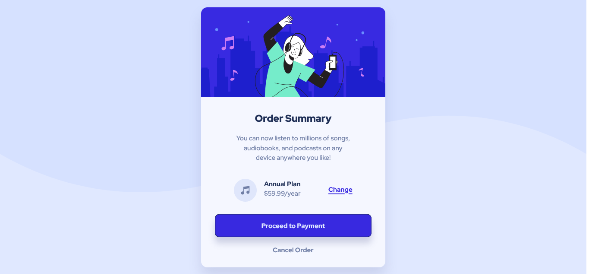

# Frontend Mentor - Order summary card solution

This is a solution to the [Order summary card challenge on Frontend Mentor](https://www.frontendmentor.io/challenges/order-summary-component-QlPmajDUj). Frontend Mentor challenges help you improve your coding skills by building realistic projects. 

## Table of contents

- [Overview](#overview)
  - [The challenge](#the-challenge)
  - [Screenshot](#screenshot)
  - [Links](#links)
- [My process](#my-process)
  - [Built with](#built-with)
  - [What I learned](#what-i-learned)
  - [Continued development](#continued-development)
  - [Useful resources](#useful-resources)
- [Author](#author)
- [Acknowledgments](#acknowledgments)

## Overview

### The challenge

Users should be able to:

- See hover states for interactive elements

### Screenshot



### Links

- Solution URL: [Github Repository](https://github.com/Pedro-Celeste/order-summary-card)
- Live Site URL: [Website Preview](https://your-live-site-url.com)

## My process

### Built with

- CSS custom properties
- Flexbox
- Mobile-first workflow
- Media queries

### What I learned

To make this webpage responsive, I needed a way to make the width of the elements change according to the screen size. This made me learn about **media queries**, which are conditional statemenets that help you to create dynamic rules.

Here's an example of a simple media query:

```css
/* This will apply a background color only to devices with screen width equal
  or larger than 600px. */
@media (min-width: 600px) {
  body { background-color: rgb(36, 36, 36); }
}
```
Besides that, I also learned how to use `svg` images as background for my webpage.

### Continued development

Making a responsive webpage takes a lot of work and I feel that I can still improve a lot on this regard.

### Useful resources

- [Media Queries](https://developer.mozilla.org/en-US/docs/Web/CSS/Media_Queries/Using_media_queries) - A useful guide on media queries. It helped me a lot during development.

## Author

- Twitter - [@oPedroCeleste](https://www.twitter.com/oPedroCeleste)
- Frontend Mentor - [@Pedro-Celeste](https://www.frontendmentor.io/profile/Pedro-Celeste)